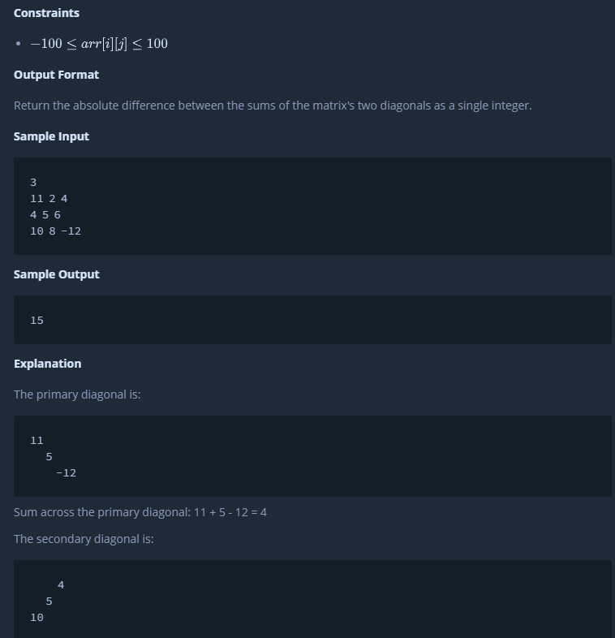
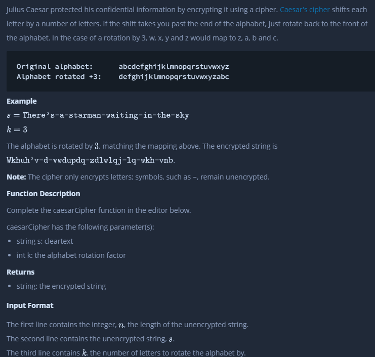
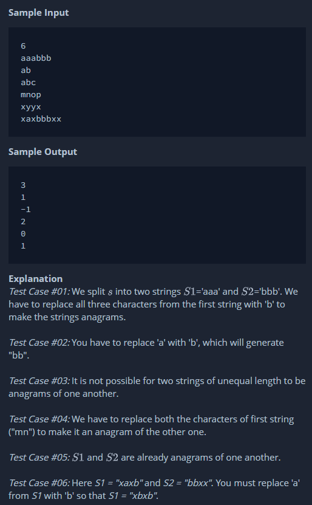
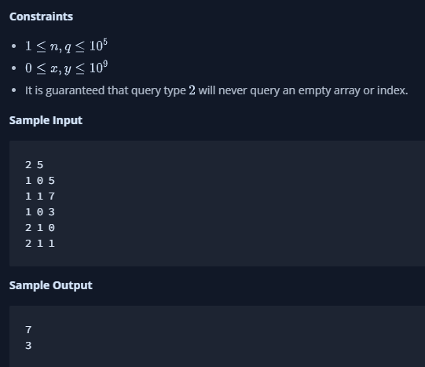

= HackerRank (3 months practice)

== Week 1

=== First Task

'''

Plus Minus

Example:

image::image-2022-01-11-09-41-21-637.png[]

'''

=== Second Task

'''

Mini-Max Sum

Example:

'''

=== Third Task

'''

Time Conversion

Example:

'''

=== Fourth Task

'''

Breaking the Records

Example:

image::image-2022-01-11-12-26-18-904.png[]

Constraints:

image::image-2022-01-11-12-26-48-552.png[]

'''

=== Fifth Task

'''

Camel Case 4

Sample input and output:

image::image-2022-01-12-12-06-55-741.png[]

'''

=== Sixth Task

'''

Divisible Sum Pairs

Example:

image::image-2022-01-15-10-02-05-075.png[]

Constraints:

image::image-2022-01-15-10-02-34-812.png[]

Explanation:

'''

=== Seventh Task

'''

Sparse Arrays

Example and result:

Constraints:

'''

=== Mock Test

'''

Find the Median

image::image-2022-01-15-10-56-52-737.png[]

== Week 2

'''

=== First Task

'''

Lonely Integer

'''

=== Second Task

'''

Grading Students

Example:

image::image-2022-01-19-11-14-06-328.png[]

Constraints:

'''

=== Third Task

'''

Flipping bits

Example:

image::image-2022-01-20-11-46-36-278.png[]

Constraints & Sample Input / Output:

image::image-2022-01-20-11-47-23-807.png[]

'''

=== Fourth Task

Diagonal Difference

'''

=== Fifth Task

Counting Sort 1.

Example

Sample input:

100
63 25 73 1 98 73 56 84 86 57 16 83 8 25 81 56 9 53 98 67 99 12 83 89 80 91 39 86 76 85 74 39 25 90 59 10 94 32 44 3 89 30 27 79 46 96 27 32 18 21 92 69 81 40 40 34 68 78 24 87 42 69 23 41 78 22 6 90 99 89 50 30 20 1 43 3 70 95 33 46 44 9 69 48 33 60 65 16 82 67 61 32 21 79 75 75 13 87 70 33

Sample output:

0 2 0 2 0 0 1 0 1 2 1 0 1 1 0 0 2 0 1 0 1 2 1 1 1 3 0 2 0 0 2 0 3 3 1 0 0 0 0 2 2 1 1 1 2 0 2 0 1 0 1 0 0 1 0 0 2 1 0 1 1 1 0 1 0 1 0 2 1 3 2 0 0 2 1 2 1 0 2 2 1 2 1 2 1 1 2 2 0 3 2 1 1 0 1 1 1 0 2 2

'''

=== Sixth Task

Counting Valleys

Example:

Explanation:

'''

=== Seventh Task

Pangrams

Example:

Constraints:

'''

=== Eighth Task

Mars Exploration

Example:

Explanation:

'''

=== Mock Test

'''

FlippingTheMatrix

'''

== Week 3

'''

=== First Task

Permuting Two Arrays

Example:

Constraints / Sample input & output:

'''

=== Second Task

Subarray Division 2

Example:

Constraints:

'''

=== Third Task

XOR String 3

Constraints:

Sample input / output:

'''

=== Fourth Task

Sales by Match

Constraints:

Sample input / output & explanation:

'''

=== Fifth Task

Migratory Birds

'''

=== Sixth Task

Maximum Perimeter Triangle

Example:

'''

=== Seventh Task

Zig Zag Sequence

'''

=== Eighth Task

Drawing Book

'''

=== Mock Test

'''

Between Two Sets

'''

== Week 4

'''

=== First Task

'''

Picking Numbers

'''

=== Second Task

Left Rotation

'''

=== Third Task

Number Line Jumps

'''

=== Fourth Task

Separate The Numbers

'''

=== Fifth Task

Closest Numbers

'''

=== Sixth Task

Tower Breakers

image::image-2022-01-31-15-49-27-356.png[]

'''

=== Seventh Task

Minimum Absolute Difference In An Array

'''

=== Eighth Task

Caesar Cipher

'''

=== Mock Test

'''

Anagram

== Week 5

'''

=== First Task

'''

Max Min

'''

=== Second Task

'''

Strong Password

'''

=== Third Task

'''

Dynamic Array

image::image-2022-02-07-14-14-43-659.png[]

'''

=== Fourth Task

'''

Smart Number 2

'''

=== Fifth Task

'''

Missing Numbers

'''

=== Sixth Task

'''

The Full Counting Sort

'''

=== Seventh Task

'''

Grid Challenge

'''

=== Eighth Task

'''

Sansa and XOR

'''

=== Mock Test

'''

Fibonacci Modified

== Week 6

'''

=== First Task

'''
